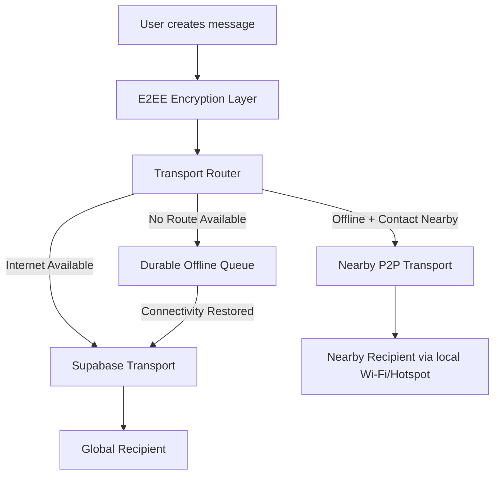
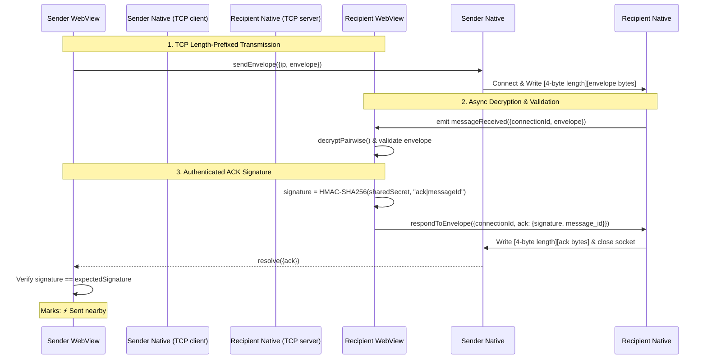
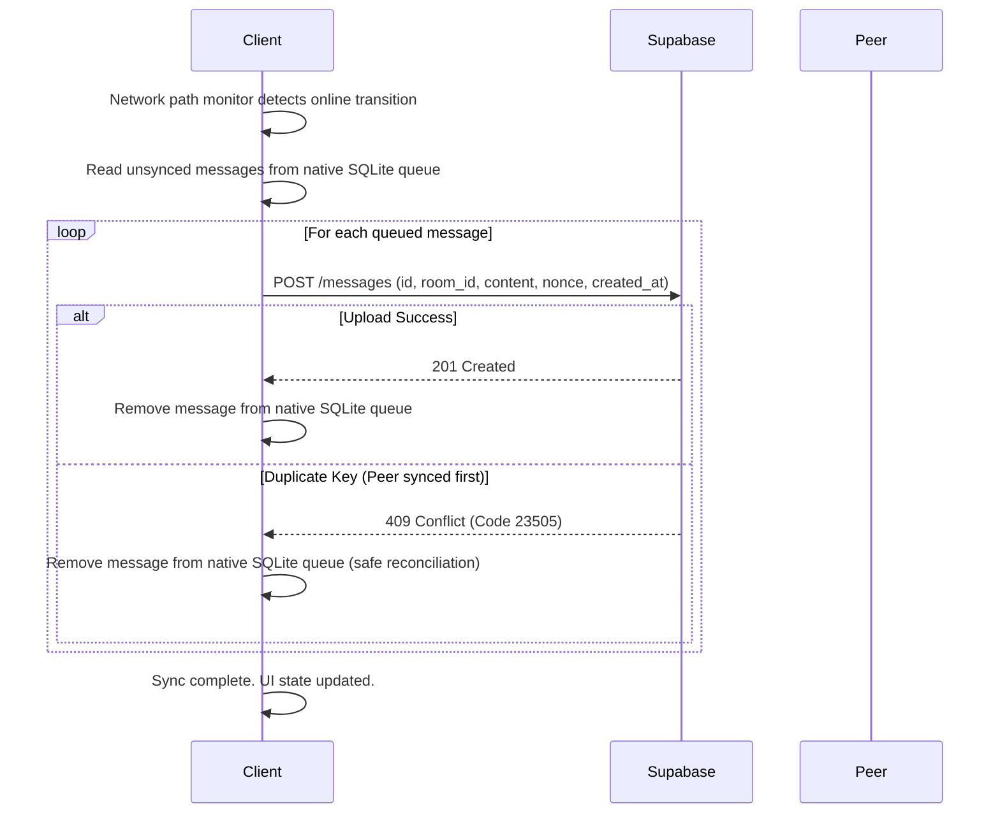

# JamSh: Offline E2EE Messaging Architecture

This document details the design, protocols, and implementation of hybrid offline + online End-to-End Encrypted (E2EE) messaging in the **JamSh** application.

---

## 1. Architectural Overview

JamSh uses a transport-independent messaging architecture. The core application layer delegates cryptographic encryption to an E2EE Layer, which yields a secure, encrypted envelope. The envelope is routed through a `TransportRouter` to decide the best available delivery path based on connectivity and recipient physical proximity.

---

## 2. System Components & Security Controls

### 2.1. Cryptographic Discovery & UDP Privacy
To prevent passive tracking and device correlation by third-party observers:
- **Zero Plaintext Identifiers**: UDP broadcast packets contain absolutely no usernames, emails, or permanent device IDs.
- **Rotating Tokens**: Presence is advertised solely via 16-character (64-bit) rotating pseudonymous tokens derived via `HMAC-SHA256(SharedSecret, Epoch)` refreshing every 15 minutes.
- **Correlation Throttling & Batching**: Devices broadcast a maximum of 5 contact tokens in a single UDP packet to respect standard 512-byte MTU sizes. The Javascript layer cycles through larger lists of contact tokens in batches of 5 every 30 seconds to prevent attackers from linking a large set of contact tokens to a single device.
- **Size Capping**: Datagram read buffers on native plugins are strictly capped at 512 bytes, rejecting any oversized/malformed payloads immediately.

### 2.2. E2EE Identity Binding & Decryption
Recipient validation uses cryptographic bindings rather than relying on claimed metadata fields:
- **Intended Recipient Validation**: The receiver validates that `recipient_id` matches the local user ID, blocking routing redirection attacks.
- **Cryptographic Sender Binding**: The receiver loads the sender's public key from a locally authenticated cache (`getCachedPublicKey`). If no authenticated key exists in storage (first-ever conversation offline), the message is rejected.
- **Decryption Enforcement**: Decryption is performed using `decryptPairwise(ciphertext, nonce, myPrivateKey, cachedSenderPublicKey)`. Decryption success (AEAD auth tag verify) is the absolute proof of sender identity; claimed JSON IDs or username fields are ignored.

### 2.3. TCP length-Prefixed Framing Protocol
To prevent deadlock states where TCP read threads block indefinitely, both Java and Swift plugins implement standard framing:
- **Format**: `[4-byte big-endian unsigned integer length-prefix][UTF-8 JSON bytes payload]`.
- **Validation**: Length is checked prior to buffer allocation. Non-positive or oversized frames (> 1MB) are instantly rejected, and the socket is closed.
- **Fractional/Truncated Read Checks**: Sockets loop to read exactly `length` bytes, handling network packet fragmentation. Sockets close instantly on EOF or truncation without waiting.

### 2.4. TCP Server Connection Map Protections
To mitigate resource exhaustion, memory leaks, and local socket DoS:
- **Global Concurrency Cap**: Active pending sockets are capped at a maximum of 10 concurrent connections.
- **Per-IP Rate Throttling**: Limits connections to a maximum of 2 concurrent connections per source IP address.
- **Background TTL Eviction**: Sockets are tracked in thread-safe dictionaries (`ConcurrentHashMap` in Java, queue-synchronized dictionaries in Swift) using a random UUID `connectionId`. An auto-eviction task is scheduled on socket creation to evict and close the connection after 15 seconds if no ACK/NACK has been written.
- **One-time Response**: Once `respondToEnvelope` is invoked, the socket is atomically removed from the active connection map and closed under all code execution paths.

### 2.5. E2EE Purpose-Separated ACK Signatures
ACK status verification is cryptographically authenticated:
- **ACK Key Derivation**: A purpose-separated ACK key $K_{ack}$ is derived from the shared secret:
  $$K_{ack} = \text{HMAC-SHA256}(K_{AB}, \text{"jamsh-ack-key"})$$
- **ACK Context Binding**: The ACK context binds all transaction metadata into an unambiguous length-prefixed canonical encoding:
  $$\text{AckContext} = \text{"v1|" } \mathbin{\Vert} \text{message\_id} \mathbin{\Vert} \text{ "|SUCCESS|" } \mathbin{\Vert} \text{recipient\_id}$$
  Encoded deterministically as:
  `[length_prefixed("v1")]|[length_prefixed(message_id)]|[length_prefixed("SUCCESS")]|[length_prefixed(recipient_id)]`
- **MAC Verification**: Sockets write the ACK packet, and the sender validates the signature via constant-time string comparisons. If validated, the UI displays `⚡ Sent nearby`.

---

## 3. Detailed Message Flow Diagrams

### 3.1. E2EE ACK Handshake Flow

### 3.2. Deduplication & Idempotent Sync

---

## 4. Known Limitations & Scalability Notes

- **Shared Network Dependency**: Due to OS-level sandboxing, direct Wi-Fi Direct link negotiation between Android and iOS is unsupported. Devices must be connected to a shared local network (e.g. portable hotspot or router).
- **iOS Background Network Slices**: Discovery and delivery will fail if the iOS app is in the background or the screen is locked, due to iOS background network constraints.
- **UDP MTU Size Limits**: The 512-byte limit on UDP packet sizes constrains the number of concurrent peer tokens that can be advertised. To scale beyond this, JamSh batches contact tokens in groups of 5 and rotates them every 30 seconds.
- **Offline First-Time Chat Limitation**: A first-ever conversation with a completely unknown user cannot be initiated fully offline because the recipient's authenticated identity/public key has never previously been obtained and cached.

---

## 5. Physical-Device Testing Instructions

To manually verify nearby P2P delivery offline:
1. Turn **Wi-Fi Internet OFF** and **Mobile Data OFF** on both devices.
2. Enable a **Wi-Fi Hotspot** on Device A.
3. Connect Device B to Device A's Hotspot.
4. Open the JamSh app on both devices. Navigate to the Messages tab.
5. Confirm the header shows **Offline Mode**.
6. Type and send a message. Verify it displays **⚡ Sent nearby** on Device A and appears decrypted on Device B.
7. Turn Hotspot OFF and connect both to cellular/internet. Verify queue sync finishes with no duplicate bubbles.
